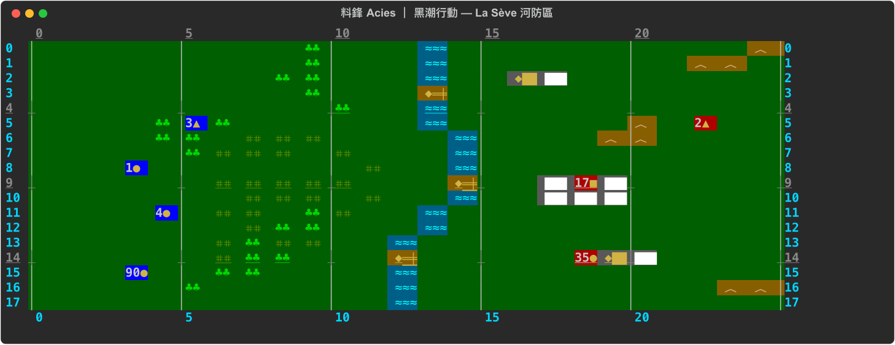
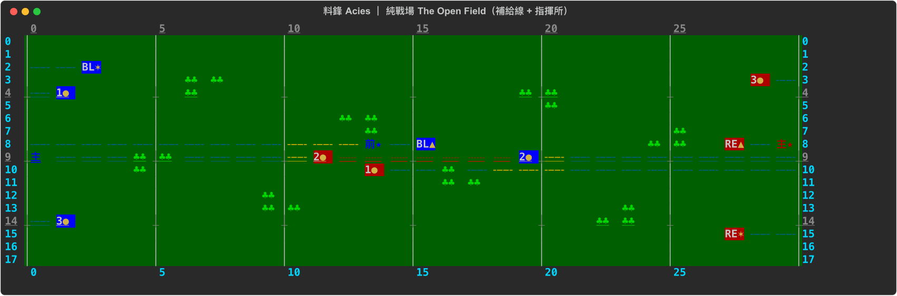

# Acies · Arbiter （料鋒 · 樞衡）

> 🌐 **English** (this page) ｜ **中文**: [README.zh.md](README.zh.md)

**A terminal WWII division-level wargame where a Large Language Model is the referee.**



---

## What it is

Most wargames encode their rules as executable code — which is why they end up rigid and complex. This project takes a different bet:

- **The rules live as natural language** (~a dozen Markdown files), and an **LLM plays the referee** — reading the rules, adjudicating combat, maintaining fog of war, and writing after-action reports.
- **No dice.** Outcomes are determined by defined inputs; the only uncertainty comes from **information asymmetry, hidden state, and reading indicators** — not from a random number generator.
- You command through a Python/[Rich](https://github.com/Textualize/rich) terminal viewer; the AI referee resolves.

*Acies* (料鋒) is the game; *Arbiter* (樞衡) is the engine — "omniscient hub that weighs and rules."

## ⚠️ Read this first: it is not a plug-and-play game

- The referee **and** the AI opponent are **LLMs** — you need an [Anthropic Claude API](https://www.anthropic.com/api) key (env var `ANTHROPIC_API_KEY`).
- Today it is a **framework / proof-of-concept driven by a human game-master (GM)**, not a fully-automated, click-to-play product.
- It is a work in progress with limited playtesting. Best understood as **a novel wargame-engine experiment**, not a finished game.

## Features

- **LLM-as-referee** — rules are natural language; the AI reads them and adjudicates.
- **Zero-randomness determinism** — no dice, no RNG. The fog of war comes from scouting and concealment, not luck.
- **Three-layer fog of war** — server-side `filter_state_for` → player viewpoint → the AI advisor only ever sees the filtered view.
- **Hour-level commands + delay queue** — orders take effect after a delay scaled to complexity (L1/L2/L3), modelling command-chain lag.
- **Battalion-level ORBAT** — divisions are fully broken out to battalions; you can detach any battalion to act on its own.
- **Realistic terminal map** — Rich renders terrain / unit type / facing / supply lines on a fixed-buffer grid aligned to coordinates.

## Two scenarios

| Scenario | Type | Highlights |
|---|---|---|
| **Black Tide** (黑潮行動) | Single-player vs AI | US III Corps has 48 hours to force the La Sève river and take Saint-Vivien; the enemy is "Adler," a German commander played by Claude (with memory — he learns your habits). |
| **Open Field** (純戰場) | 1v1 PvP | A symmetric, terrain-neutral duel of pure tactics. Features **supply-line interdiction** and a **command-post / decapitation** system; victory is by attrition. |



*Open Field: the dashed lines are supply corridors (blue = intact / yellow = threatened / red = cut); `主`/`前★` mark command posts (★ = where the commander is).*

## Install

```bash
pip install -r requirements.txt
export ANTHROPIC_API_KEY=sk-...        # needed for the AI referee / advisor
```

## Getting started

```bash
# Generate a clean opening
python3 blacktide_setup.py             # Black Tide  -> state.json
python3 openfield_setup.py             # Open Field  -> maps/open_field_state.json

# Watch the battlefield (terminal map)
python3 map.py                                                   # Black Tide, god view
python3 map.py --state maps/open_field_state.json --supply      # Open Field + supply layer
python3 map.py --side allies                                    # player view (own units + spotted enemy)

# Inspect the battalion ORBAT
python3 orbat.py --side allies
```

How the referee actually runs a game: see `prompts/referee_gm.md` (Black Tide) and `prompts/referee_pvp.md` (Open Field).

> Note: the code and rule files are written in **Chinese** (the project's working language). The concept and the code are followable regardless; this README is the English entry point.

## Architecture (main modules)

| File | Responsibility |
|---|---|
| `mapcore.py` | Shared render core: terrain / units / supply-line layer, fog filtering |
| `map.py` | Live terminal viewer |
| `orbat.py` | Battalion ORBAT, detach / rejoin |
| `hourstate.py` | Hour-level clock + command delay queue |
| `command.py` | Command posts / comms delay / decapitation (PvP) |
| `advisor.py` | AI staff officer (Claude API; only ever sees the filtered viewpoint) |
| `server.py` / `client.py` | 1v1 networking (token auth + Cloudflare Tunnel) |
| `*_v1.md` / `scenario*.md` | Natural-language rules and scenario definitions |

## Status

Proof-of-concept. The engine and both scenarios are in place with unit tests (`python3 test_hourstate.py`, `python3 command.py`), but real game-play testing is still limited. Come poke at it, critique it, and fork it as an experiment in LLM-driven game design.

## Contact

Questions, ideas, or want to talk about the LLM-as-referee concept? **[Open an issue](https://github.com/ethan104091-del/acies-arbiter/issues)** — that's the fastest way to reach me. Stars / forks / PRs welcome too.

## License

[MIT](LICENSE)
